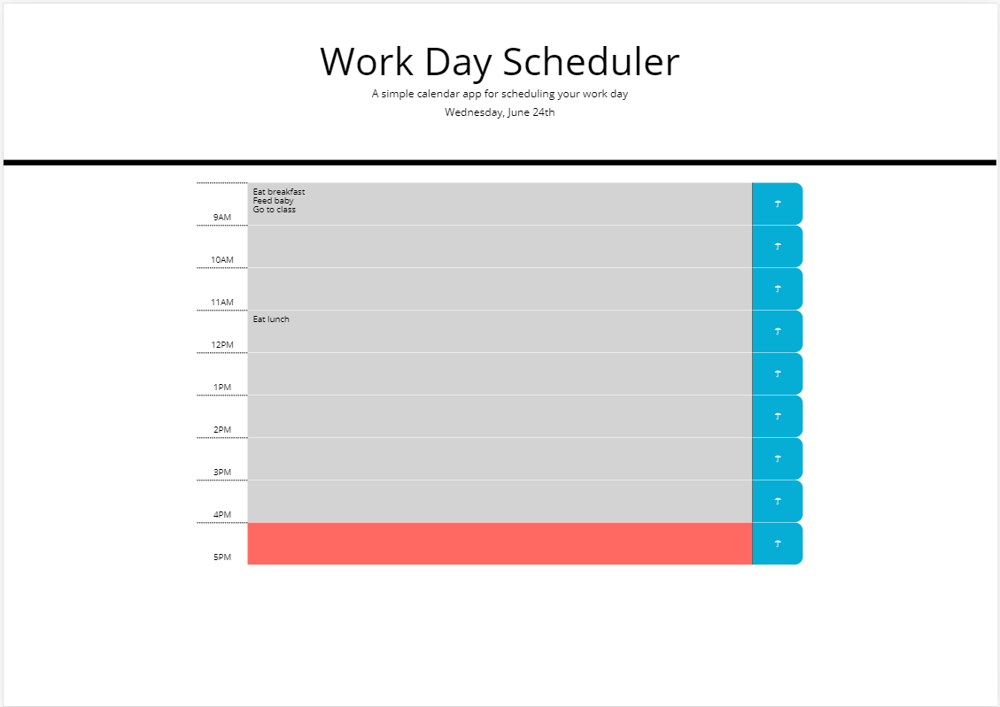

# work_day_scheduler

## Background
The objective of this exercise was to create a dynamically updated work calendar that allows the user to save events for each hour of the work day.

Acceptance criteria is as follows:

```
GIVEN I am using a daily planner to create a schedule
WHEN I open the planner
THEN the current day is displayed at the top of the calendar
WHEN I scroll down
THEN I am presented with timeblocks for standard business hours
WHEN I view the timeblocks for that day
THEN each timeblock is color coded to indicate whether it is in the past, present, or future
WHEN I click into a timeblock
THEN I can enter an event
WHEN I click the save button for that timeblock
THEN the text for that event is saved in local storage
WHEN I refresh the page
THEN the saved events persist
```

## Site Pictures


## Approach

There were a few key areas to focus on in this project:
1) How to get the time elements to dynamically update and show the appropriate class during the correct time
2) Functionality of entering an event and having it remain in local storage


### Dynamic updates

An example of Moment.js was provided for reference prior to commencement of this project. In order to leverage Moment.js to dynamically update classes on the page, data-values were assigned to each time bar representing the upper limit of the number of seconds for its corresponding time.  For example, for 11am contains a data-value of "43199" which is equivalent to 11:59AM and 59 seconds. A comparison statement was then used to determine the classes to apply depending on the time of the day.

```
// dynamically updates classes for time elements
    let updateSeconds = function () {
        let todayHours = moment().hour();
        let todaySeconds = todayHours * 60 * 60;
        let thisSecond = moment().second();
        let sumSeconds = thisSecond + todaySeconds;
        for (var i = 0; i < allTimesSeconds.length; i++) {
            if (allTimesSeconds[i] < sumSeconds) {
                $(allTimes[i]).addClass("past");
                $(allTimes[i]).removeClass("present future");
            }
            else if (allTimesSeconds[i] >= sumSeconds && allTimesSeconds[i] - 3599 <= sumSeconds) {
                $(allTimes[i].addClass("present"));
                $(allTimes[i].removeClass("past future"));
            }
            else {
                $(allTimes[i].addClass("future"));
                $(allTimes[i].removeClass("past present"));
            }
        }
    }
```


### Entering an event and having it remain in local storage

Originally, the application was built using a form with position absolute on top of a div with position relative.  While this ultimately worked, it did not allow for the best user experience as editing existing entries was not allowed.  As such, textarea was utilized in lieu of the aforementioned approach.  Once the user enters his/her desired task, he/she clicks on the save button and the value in the textarea is set in localstorage.  These values are recalled when the page is reloaded.

## Built With

* [HTML](https://developer.mozilla.org/en-US/docs/Web/HTML)
* [CSS](https://developer.mozilla.org/en-US/docs/Web/CSS)
* [Bootstrap](https://getbootstrap.com/)
* [JS](https://developer.mozilla.org/en-US/docs/Web/JavaScript)
* [jquery](https://jquery.com/)

## Deployed Link

* [See Live Site](https://cofchips.github.io/work_day_scheduler/)


## Authors

* **CHRISTOPHER LEE** 

- [Link to Github](https://github.com/CofChips)
- [Link to LinkedIn](https://www.linkedin.com/in/christophernlee/)

## Acknowledgments
